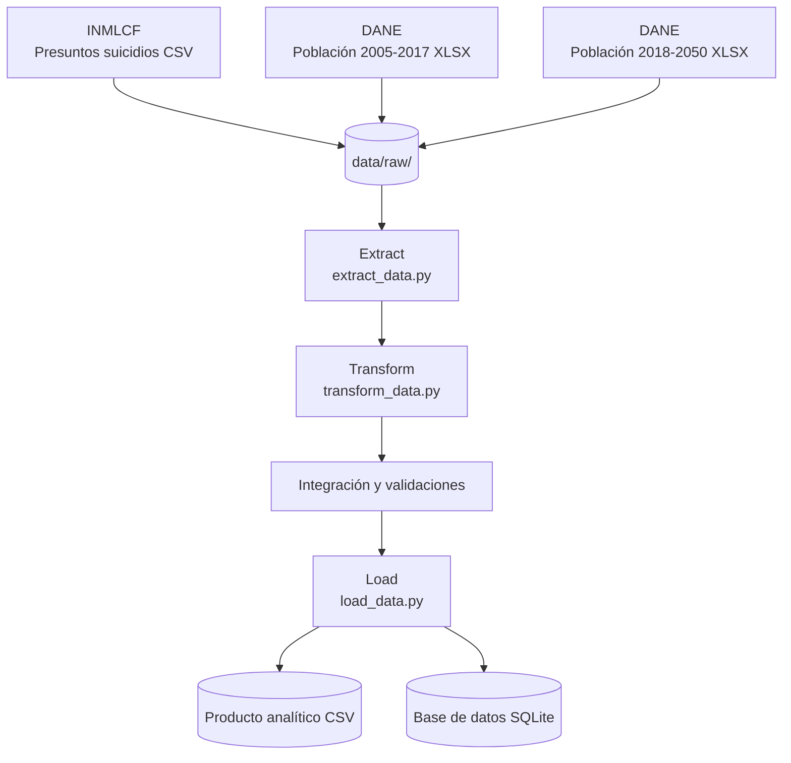

# Predicción de factores asociados a la tasa de presuntos suicidios en Colombia (2015-2024)

> Pipeline ETL que integra registros del INMLCF con proyecciones poblacionales del DANE, transforma los datos y genera un producto analítico en CSV y SQLite para estudiar las tasas de presuntos suicidios por departamento, sexo, edad y año.

**Curso:** ETL — Maestría en Inteligencia Artificial y Ciencia de Datos, Universidad Autónoma de Occidente  
**Periodo:** 2026-2  
**Docente:** Fernando Barraza Alvarado

## Integrantes

| Nombre | Código | Usuario de GitHub |
|---|---|---|
| William Andres Linarez Salazar | 22611972 | @william-and-linarez(https://github.com/william-and-linarez) |

## Tabla de contenido

1. [Descripción del problema](#1-descripción-del-problema)
2. [Fuentes de datos](#2-fuentes-de-datos)
3. [Arquitectura del pipeline](#3-arquitectura-del-pipeline)
4. [Estructura del repositorio](#4-estructura-del-repositorio)
5. [Requisitos](#5-requisitos)
6. [Instalación y configuración](#6-instalación-y-configuración)
7. [Ejecución](#7-ejecución)
8. [Detalle de las etapas ETL](#8-detalle-de-las-etapas-etl)
9. [Modelo y diccionario de datos](#9-modelo-y-diccionario-de-datos)
10. [Calidad de datos y validaciones](#10-calidad-de-datos-y-validaciones)
11. [Resultados](#11-resultados)
12. [Limitaciones y trabajo futuro](#12-limitaciones-y-trabajo-futuro)
13. [Referencias](#13-referencias)

## 1. Descripción del problema

Los registros de presuntos suicidios del Instituto Nacional de Medicina Legal y Ciencias Forenses (INMLCF) contienen información sobre los casos, pero para comparar territorios es necesario considerar también el tamaño y la composición demográfica de sus poblaciones. Comparar únicamente los conteos absolutos puede conducir a interpretaciones equivocadas, porque los departamentos tienen poblaciones muy diferentes.

El proyecto busca generar información analítica para estudiar las diferencias territoriales en las tasas de presuntos suicidios y su asociación con variables demográficas. Los resultados pueden servir como insumo exploratorio para investigadores y entidades interesadas en la vigilancia epidemiológica y el análisis de salud pública.

**Objetivo:** construir un pipeline ETL reproducible que integre los registros del INMLCF y las proyecciones poblacionales del DANE, genere tasas por cada 100.000 habitantes y produzca una tabla apta para análisis estadístico y modelado.

El análisis es asociativo y no permite establecer causalidad ni estimar directamente el riesgo individual de una persona.

## 2. Fuentes de datos

Se utilizan tres archivos provenientes de fuentes oficiales.

| Fuente | Tipo | Origen / URL | Tamaño aproximado | Frecuencia de actualización | Licencia / condiciones |
|---|---|---|---|---|---|
| INMLCF: Presuntos suicidios, Colombia 2015-2024 | CSV | [Datos Abiertos Colombia](https://www.datos.gov.co/Justicia-y-Derecho/Presuntos-Suicidios-Colombia-2015-a-2024-Cifras-de/f75u-mirk/about_data) | 12,22 MB; 26.558 filas × 32 columnas | Serie histórica 2015-2024; el pipeline no consulta actualizaciones automáticas | Consultar las condiciones de uso y atribución indicadas en la ficha oficial |
| DANE: proyecciones poblacionales 2005-2017 | XLSX | [DANE - Proyecciones de población](https://www.dane.gov.co/index.php/estadisticas-por-tema/demografia-y-poblacion/proyecciones-de-poblacion) | 2,29 MB; 1.287 filas × 310 columnas | Publicación institucional de series poblacionales; no se actualiza automáticamente durante la ejecución | Información estadística oficial; citar al DANE y consultar sus condiciones de uso |
| DANE: proyecciones poblacionales 2018-2050 | XLSX | [DANE - Proyecciones de población](https://www.dane.gov.co/index.php/estadisticas-por-tema/demografia-y-poblacion/proyecciones-de-poblacion) | 10,81 MB; 2.937 filas × 310 columnas | Publicación institucional de series poblacionales; no se actualiza automáticamente durante la ejecución | Información estadística oficial; citar al DANE y consultar sus condiciones de uso |

Los archivos utilizados se conservan en `data/raw/`. Los tamaños corresponden a los archivos de entrada empleados en el proyecto.

La extracción no descarga automáticamente los archivos desde internet: lee las copias locales previamente obtenidas de las fuentes oficiales.

## 3. Arquitectura del pipeline



El pipeline lee las fuentes locales, transforma los archivos de población y agrega los casos del INMLCF a una granularidad demográfica común. Después integra ambas fuentes mediante códigos territoriales, año, sexo y grupo de edad, calcula las tasas y valida el producto final.

Se utiliza Python con pandas para la manipulación de datos y SQLite para el almacenamiento estructurado. La elección de SQLite permite consultar el resultado mediante SQL sin configurar un servidor de base de datos. También se conserva una versión CSV para facilitar su utilización en otras herramientas analíticas.

**Tecnologías:** Python, pandas, openpyxl, SQLite y statsmodels.

## 4. Estructura del repositorio

```text
proyecto-etl-suicidios-colombia/
├── analysis/
│   ├── modelo.py
│   └── resultados/
│       ├── evaluacion_departamental_2024.csv
│       ├── metricas_validacion_2024.csv
│       └── predicciones_2024_por_celda.csv
├── data/
│   ├── raw/
│   │   ├── Presuntos_Suicidios._Colombia,_2015-2024..csv
│   │   ├── proypoblacion2005-2017.xlsx
│   │   └── proypoblacion2018-2050.xlsx
│   └── processed/
│       ├── suicidios_departamento_edad_sexo_2015_2024.csv
│       └── suicidios_departamento_edad_sexo_2015_2024.db
├── docs/
│   └── modelo_y_validacion.md
├── extract/
│   └── extract_data.py
├── load/
│   └── load_data.py
├── transform/
│   └── transform_data.py
├── pipeline.py
├── requirements.txt
├── .gitignore
└── README.md
```

- `data/raw/`: conserva las fuentes originales.
- `data/processed/`: contiene los productos finales del ETL.
- `extract/`, `transform/` y `load/`: separan las responsabilidades de cada etapa.
- `analysis/`: contiene las funciones estadísticas y los resultados de evaluación.
- `docs/`: contiene la documentación complementaria.
- `pipeline.py`: coordina la ejecución completa.
- `requirements.txt`: declara las dependencias.
- `.gitignore`: excluye archivos temporales y de entorno.

## 5. Requisitos

- Python 3.11 o superior.
- Git para clonar el repositorio.
- Archivos originales disponibles en `data/raw/`.
- Dependencias indicadas en `requirements.txt`.

Dependencias principales:

- `pandas==2.2.3`
- `openpyxl==3.1.5`
- `statsmodels==0.15.0`

`sqlite3` y `pathlib` forman parte de la biblioteca estándar de Python.

## 6. Instalación y configuración

### Clonar el repositorio

```bash
git clone https://github.com/william-and-linarez/proyecto-etl-suicidios-colombia.git
cd proyecto-etl-suicidios-colombia
```

### Crear y activar un entorno virtual

Windows:

```powershell
python -m venv .venv
.venv\Scripts\activate
```

Linux o macOS:

```bash
python -m venv .venv
source .venv/bin/activate
```

### Instalar las dependencias

```bash
python -m pip install --upgrade pip
pip install -r requirements.txt
```

### Variables de entorno

El pipeline ETL no requiere variables de entorno, credenciales ni acceso a un servidor externo de base de datos. Los archivos se leen desde `data/raw/` y los resultados se escriben en `data/processed/`.

No es necesario crear un archivo `.env` para ejecutar el pipeline.

### Obtención de los datos

Descargue los archivos desde las fuentes oficiales indicadas en la sección 2 y colóquelos en `data/raw/`, respetando exactamente estos nombres:

- `Presuntos_Suicidios._Colombia,_2015-2024..csv`
- `proypoblacion2005-2017.xlsx`
- `proypoblacion2018-2050.xlsx`

El proceso de extracción comprueba que los tres archivos estén disponibles. Si alguno falta, se genera un error que indica la ruta correspondiente.

## 7. Ejecución

Ejecute el pipeline desde la raíz del repositorio:

```bash
python pipeline.py
```

### Salida esperada

El proceso muestra las dimensiones de las fuentes originales, el número de casos válidos, el resultado de las validaciones y las rutas de los productos generados.

Se generan o reemplazan estos archivos:

- `data/processed/suicidios_departamento_edad_sexo_2015_2024.csv`
- `data/processed/suicidios_departamento_edad_sexo_2015_2024.db`

El proceso de carga utiliza reemplazo de la tabla SQLite, no una carga incremental. La ejecución verificada en Google Colab terminó con código de salida `0` y el mensaje `PIPELINE EJECUTADO CORRECTAMENTE`.

El tiempo de ejecución depende del equipo y del entorno donde se ejecute.

El análisis estadístico se ejecuta por separado mediante las funciones de `analysis/modelo.py`, tomando como entrada la tabla almacenada en SQLite.

## 8. Detalle de las etapas ETL

### 8.1. Extract

- **Qué hace:** verifica la existencia de los tres archivos originales y los carga en DataFrames de pandas.
- **Script:** `extract/extract_data.py`
- **Entrada:** archivos ubicados en `data/raw/`.
- **Salida:** tres DataFrames en memoria para su procesamiento posterior.

### 8.2. Transform

- **Qué hace:** limpia, armoniza y agrega las fuentes para construir una tabla con claves y granularidad compatibles.
- **Script:** `transform/transform_data.py`
- **Salida:** tabla analítica integrada con casos, población, tasa e indicadores de calidad.

| # | Transformación | Justificación |
|---|---|---|
| 1 | Estandarización de nombres de columnas | Facilitar el acceso uniforme a las variables |
| 2 | Exclusión de cuatro registros con código territorial 999 | Evitar asignar casos sin código territorial válido a un departamento |
| 3 | Selección de los años 2015-2024 | Alinear los periodos de casos y población |
| 4 | Selección del total por área geográfica | Utilizar el denominador poblacional total, sin sumar áreas que podrían duplicarlo |
| 5 | Transformación de las tablas poblacionales de formato ancho a largo | Permitir la manipulación de edad, sexo y población como variables |
| 6 | Armonización de los grupos de edad | Hacer compatibles los grupos del INMLCF con las edades simples del DANE |
| 7 | Agregación de población por departamento, año, sexo y grupo de edad | Establecer la granularidad común para la integración |
| 8 | Agregación de casos por las mismas claves | Contar los casos en la misma unidad analítica que la población |
| 9 | Integración mediante códigos territoriales y variables demográficas | Obtener casos y denominadores comparables en una misma tabla |
| 10 | Exclusión de la población de 0-4 años | Restringir la población de análisis a personas de cinco años o más |
| 11 | Asignación de cero casos a combinaciones sin registros después de integrar | Diferenciar una combinación sin casos registrados de una combinación ausente |
| 12 | Cálculo de tasas por cada 100.000 habitantes | Permitir comparaciones ajustadas por tamaño poblacional |
| 13 | Creación de `baja_frecuencia` | Identificar celdas con menos de cinco casos y advertir sobre su inestabilidad |

No se eliminan automáticamente las celdas con pocos casos. La bandera de baja frecuencia permite conservar la información sin ocultar las limitaciones de las tasas en grupos pequeños.

### 8.3. Load

- **Qué hace:** exporta la tabla analítica a CSV y la almacena en una base SQLite.
- **Script:** `load/load_data.py`
- **Destinos:**
  - `data/processed/suicidios_departamento_edad_sexo_2015_2024.csv`
  - `data/processed/suicidios_departamento_edad_sexo_2015_2024.db`
- **Tabla de destino:** `suicidios_analitico`
- **Modo de carga:** reemplazo completo de los productos, apropiado para reproducir el resultado a partir de las fuentes disponibles.

## 9. Modelo y diccionario de datos

El producto utiliza una tabla analítica plana. No se implementó un modelo dimensional en estrella porque el alcance del proyecto consiste en integrar tres fuentes para el análisis estadístico y el producto tiene 11.220 filas.

La granularidad es una fila por combinación de código territorial, año, sexo y grupo de edad.

**Tabla SQLite:** `suicidios_analitico`

**Archivo CSV:** `suicidios_departamento_edad_sexo_2015_2024.csv`

### Diccionario de datos

| Columna | Tipo | Descripción | Ejemplo |
|---|---|---|---|
| `DP` | Entero | Código territorial DANE | `5` |
| `AÑO` | Entero | Año de observación | `2024` |
| `serie_poblacion` | Texto | Serie poblacional utilizada | `DANE_2018_2050` |
| `sexo` | Texto | Sexo registrado | `Hombre` |
| `grupo` | Texto | Grupo de edad armonizado | `(20 a 24)` |
| `poblacion` | Entero | Población del grupo demográfico | `10000` |
| `casos` | Entero | Número de casos registrados | `3` |
| `tasa_x100k` | Real | Casos por cada 100.000 habitantes | `30.0` |
| `baja_frecuencia` | Entero (0/1) | Indicador de menos de cinco casos | `1` |
| `departamento` | Texto | Nombre de la entidad territorial | `Antioquia` |

La tasa se calcula como:

\[
\text{tasa\_x100k} =
\frac{\text{casos}}{\text{poblacion}} \times 100.000
\]

Los ejemplos de la tabla son ilustrativos.

### Modelo estadístico

Se ajustó una regresión Poisson para estudiar la asociación entre los conteos de casos y las variables demográficas y territoriales. La población se incorpora como exposición.

Modelo principal de asociación:

```text
casos ~ C(sexo) * C(grupo) + C(AÑO) + C(DP)
```

La interacción sexo por grupo de edad permite que la asociación entre sexo y tasa cambie según la edad. Las razones de tasas (IRR) se interpretan respecto de las categorías de referencia del modelo.

Para la validación temporal de 2024, el año se trató como variable numérica para permitir la extrapolación temporal:

```text
casos ~ C(sexo) * C(grupo) + AÑO + C(DP)
```

La interpretación es asociativa, no causal. La dispersión de Pearson del modelo principal fue 1,09.

## 10. Calidad de datos y validaciones

La validación se realiza durante el pipeline, antes de cargar el producto final.

| Verificación | Antes / entrada | Después / resultado |
|---|---|---|
| Registros de presuntos suicidios | 26.558 | 26.554 casos territoriales válidos |
| Registros excluidos por código territorial 999 | 0 excluidos antes del filtro | 4 excluidos |
| Filas del producto analítico | Combinaciones pendientes de integración | 11.220 |
| Entidades territoriales | Fuentes con nombres y estructuras diferentes | 33 |
| Años | Fuentes con periodos distintos | 2015-2024 |
| Categorías de sexo | Fuentes integradas | 2 |
| Grupos de edad | Estructuras originales distintas | 17 |
| Duplicados en clave `DP`, `AÑO`, `sexo`, `grupo` | No aplica a la tabla de casos antes de agregar | 0 |
| Casos nulos o negativos | Campos sujetos a validación | 0 en el producto validado |
| Poblaciones nulas o no positivas | Campos sujetos a validación | 0 en el producto validado |
| Nombre territorial nulo | Campo agregado desde DANE | 0 en el producto validado |
| Consistencia de la tasa | Casos, población y tasa calculada | Validación correcta |
| Consistencia de `baja_frecuencia` | Casos y bandera calculada | Coincide con `casos < 5` |

La ejecución final confirmó:

- 11.220 filas.
- 33 entidades territoriales.
- 10 años (2015-2024).
- 2 categorías de sexo.
- 17 grupos de edad.
- 26.554 casos válidos.
- Cero duplicados en la clave analítica.
- Validación final: `OK`.

La bandera `baja_frecuencia` identifica combinaciones con menos de cinco casos; estas se conservan para no eliminar información relevante, pero sus tasas deben interpretarse con cautela.

## 11. Resultados

### Producto del ETL

El pipeline genera una tabla analítica con 11.220 filas y 10 columnas, almacenada en CSV y SQLite.

El producto integra los 26.554 casos con información poblacional para estimar tasas por cada 100.000 habitantes en personas de cinco años o más.

### Resultado de la validación temporal

El modelo se entrenó con 2015-2023 y se evaluó en el año reservado 2024.

| Métrica | Resultado |
|---|---:|
| Observaciones de prueba | 1.122 |
| MAE por celda | 1,079 |
| RMSE por celda | 1,812 |
| Correlación observado-predicho | 0,943 |
| Casos observados en 2024 | 3.013 |
| Casos predichos en 2024 | 3.160,915 |

El modelo sobreestimó el total de 2024 en aproximadamente 148 casos, equivalente a cerca del 4,9 % de los casos observados.

### Evaluación por departamento

| Métrica | Resultado |
|---|---:|
| Departamentos evaluados | 33 |
| MAE departamental | 11,402 |
| RMSE departamental | 19,304 |
| Correlación departamental | 0,989 |
| Sesgo neto (predicho menos observado) | +147,915 casos |
| Suma de errores absolutos | 376,259 |
| WAPE | 12,49 % |

La correlación alta refleja una asociación fuerte entre los conteos departamentales observados y predichos, pero no implica precisión perfecta en cada territorio. Se encontraron diferencias relevantes, como una sobreestimación para Bogotá y una subestimación para Nariño.

### Consulta SQL de ejemplo

La siguiente consulta calcula los casos acumulados, la población acumulada y la tasa por cada 100.000 habitantes de cinco años o más por departamento y año:

```sql
SELECT
    departamento,
    "AÑO" AS anio,
    SUM(casos) AS casos,
    SUM(poblacion) AS poblacion,
    SUM(casos) * 100000.0 / SUM(poblacion) AS tasa_x100k
FROM suicidios_analitico
GROUP BY departamento, "AÑO"
ORDER BY anio, tasa_x100k DESC;
```

### Archivos de resultados

Los resultados de la validación temporal se guardan en:

- `analysis/resultados/predicciones_2024_por_celda.csv`
- `analysis/resultados/evaluacion_departamental_2024.csv`
- `analysis/resultados/metricas_validacion_2024.csv`

La documentación detallada del modelo se encuentra en `docs/modelo_y_validacion.md`.

### Evidencia de ejecución

La ejecución del pipeline desde un proceso independiente de Python terminó con código de salida `0` y el mensaje `PIPELINE EJECUTADO CORRECTAMENTE`. Los archivos finales CSV y SQLite se generaron después de validar el producto analítico.

## 12. Limitaciones y trabajo futuro

### Limitaciones

- El producto analiza personas de cinco años o más y excluye cuatro registros sin código territorial válido.
- Varias combinaciones de departamento, sexo y edad presentan baja frecuencia, lo que puede producir tasas inestables.
- Los resultados dependen de la calidad de los registros administrativos y de las proyecciones poblacionales.
- Las tasas describen casos registrados y no deben interpretarse como causalidad ni como riesgo individual.
- La validación predictiva utiliza un único año reservado (2024), por lo que no garantiza desempeño futuro.
- Algunos departamentos presentan errores de predicción relevantes a pesar de la correlación territorial alta.
- Los archivos originales deben obtenerse manualmente; el pipeline no automatiza su descarga desde las fuentes oficiales.
- La licencia específica debe consultarse en las fichas oficiales de las fuentes.

### Trabajo futuro

- Incorporar pruebas automatizadas para cada etapa ETL.
- Evaluar el modelo con más ventanas temporales y comparar modelos alternativos.
- Analizar la sensibilidad de los resultados a las series poblacionales y al año reservado.
- Añadir visualizaciones reproducibles de tasas, errores y diferencias territoriales.
- Automatizar, cuando sea viable, la verificación de disponibilidad y actualización de las fuentes oficiales.
- Fortalecer el tratamiento de celdas con baja frecuencia y la evaluación de incertidumbre.

## 13. Referencias

- Instituto Nacional de Medicina Legal y Ciencias Forenses (INMLCF). *Presuntos suicidios. Colombia, 2015 a 2024. Cifras definitivas.* Datos Abiertos Colombia. [Consultar fuente](https://www.datos.gov.co/Justicia-y-Derecho/Presuntos-Suicidios-Colombia-2015-a-2024-Cifras-de/f75u-mirk/about_data).
- Departamento Administrativo Nacional de Estadística (DANE). *Proyecciones y retroproyecciones de población.* [Portal oficial](https://www.dane.gov.co/index.php/estadisticas-por-tema/demografia-y-poblacion/proyecciones-de-poblacion).
